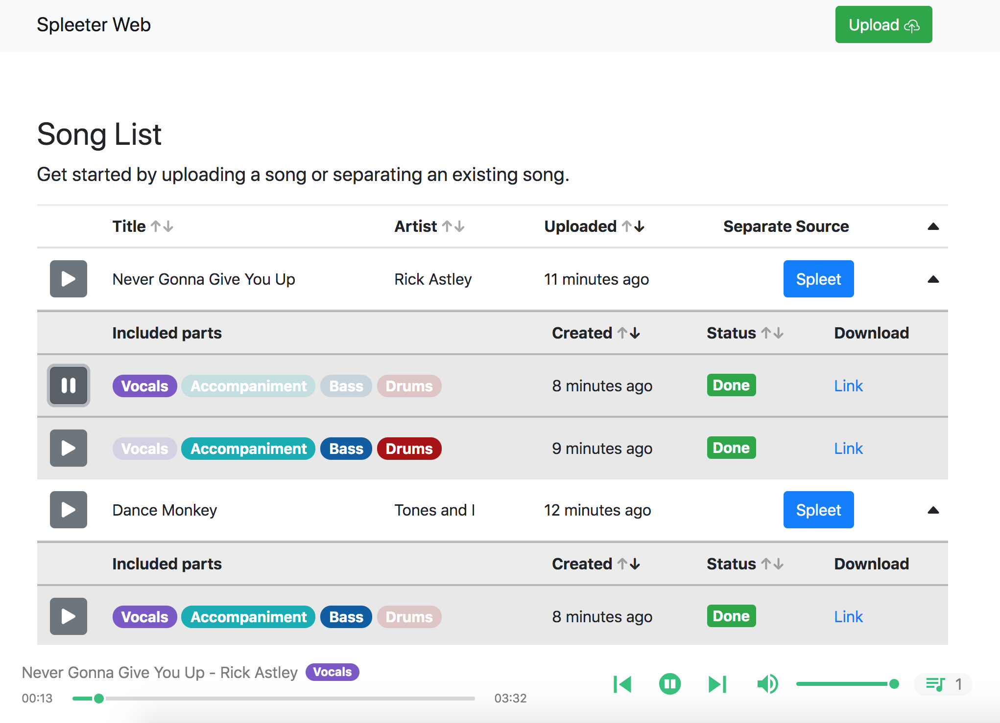

# Spleeter Web
A web application for isolating or removing the vocal, accompaniment, bass, and/or drum components of any song. For example, you can use it to isolate the vocals of a track, or remove the vocals to get an instrumental version of a song.

It is powered by [Spleeter](https://github.com/deezer/spleeter), the awesome source separation library from Deezer. Specifically, it uses the pretrained [`4stems-model`](https://github.com/deezer/spleeter/wiki/3.-Models#pretrained-model) model, which performs audio separation very well.

The app uses [Django](https://www.djangoproject.com/) for the backend API, [React](https://reactjs.org/) for the frontend, [PostgreSQL](https://www.postgresql.org/) for the database, and [Huey](https://huey.readthedocs.io/en/latest/)+[Redis](https://redis.io/) for the task queue.



## Getting started with Docker
### Requirements
* 4 GB+ of memory (source separation is memory-intensive)
* Docker

`// TODO`

## Getting started without Docker
### Requirements
* 4 GB+ of memory (source separation is memory-intensive)
* Python 3.6+
* Node.JS 12
* Redis
* PostgreSQL
* ffmpeg

1. Authenticate to GitHub Packages:
    > This is needed because some of the Node packages are hosted on GitHub Packages instead of NPM.

    First, [create a new personal access token](https://github.com/settings/tokens/new) with the `read:packages` scope.
    
    Add the following line to your `~/.npmrc` file (create one if it doesn't exist):
    ```
    //npm.pkg.github.com/:_authToken=TOKEN
    ```
2. Install Python dependencies
    ```sh
    > python3 -m venv env
    > source env/bin/activate
    > pip3 install -r requirements.txt
    ```
3. Install Node dependencies
    ```sh
    > cd frontend
    > npm install
    ```
4. Start backend and frontend servers (from project directory):
    ```sh
    > npm run dev --prefix frontend & python manage.py runserver 0.0.0.0:8000
    ```
2. In a separate session, start Huey worker (Redis should be running):
    ```sh
    > source env/bin/activate
    > python manage.py run_huey
    ```

## Deploying
The app in its current state is not ready to be deployed yet!
